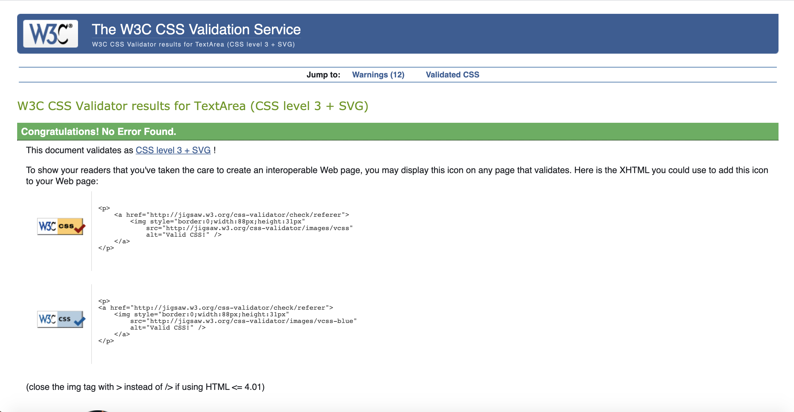
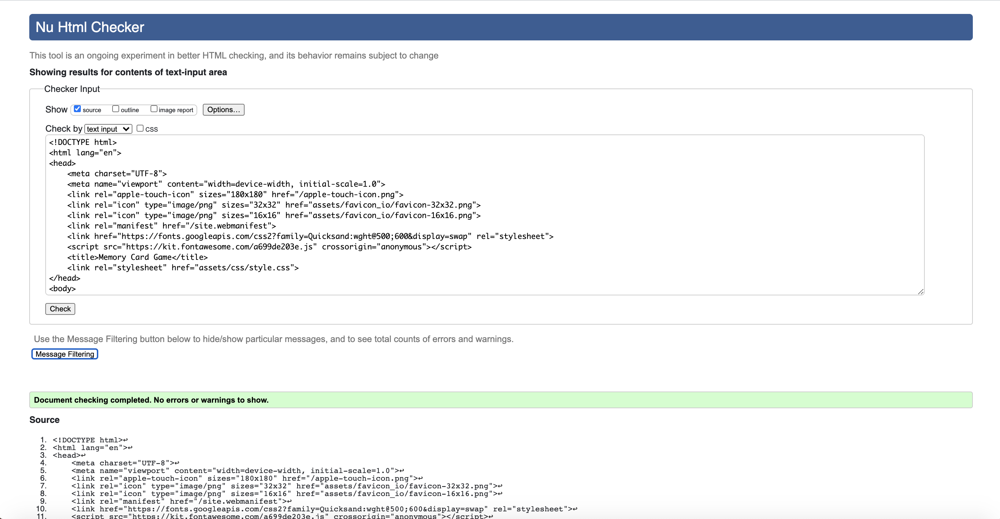
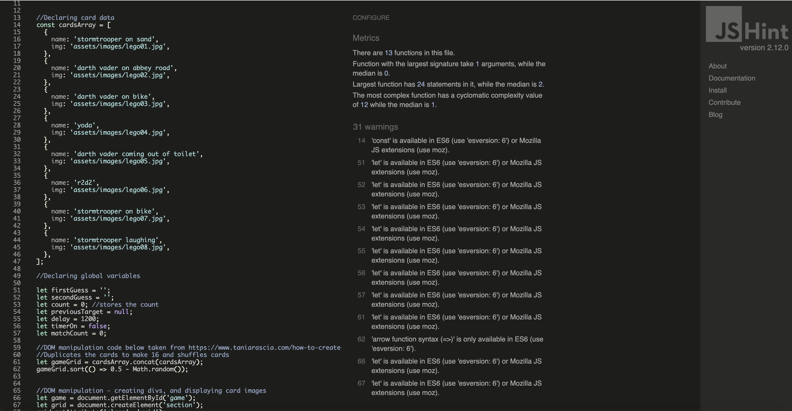

# 
Testing for [*IN EDITING MODE*](https://karzuin.github.io/???/)

Used [W3C HTML validator](https://validator.w3.org/#validate_by_input) website via the direct input path. 

1. Index.html validator results.

Used [Jigsaw](https://jigsaw.w3.org/css-validator/#validate_by_input) via the direct input path. 

2. Style.css validator results.

3. JShint validator results.

## User stories:

- As a user, I want a simple and clean looking website as messy, busy pages with lots of information overwhelms me.

- As a user, I want an easy to navigate website to save time and not get frustrated or lost.

- As a user, I want to be able to use it on desktop, tablet and mobile devices.

- As a user, I want to have a fun time playing the game.

- As a user, I want to see interesting and fun images some easy to memorise and some not so easy.

- As a user, I want simple instructions.

- As a user, I want to challenge my brain and exercise my memory.

  - **Bug**: The last link of the three lists has a blue border once it has been clicked which is useful for the user to know when they come back from the external link which was the last link they clicked. But the other links do not do that.

  - **Debugged**: Added the same code from the last link to the rest of the links. Now they all show a blue border when the link has been clicked.

  - **Bug**: The other three white background links go light grey when it has been clicked and the green background link does not indicate anything when clicked.

  - **Debugged**: Changed all the background colour links to light green and added the border code to all the links. Now when user hovers over the link it goes a darker green and when clicked shows a blue border to indicate it was the last link clicked.

# Responsiveness of website

## [Home.html](https://karzuin.github.io/First-milestone-project/index.html) in Desktop view.
In desktop mode, 

## [Home.html](https://karzuin.github.io/First-milestone-project/index.html) in iPad/iPad Pro view.

In iPad mode, 
- **Bug**: 

## [Home.html](https://karzuin.github.io/First-milestone-project/index.html) in iPhone X, 5, 6, 7, 8 view.

In mobile phone mode, 

- **Bug**: 

# Responsiveness on different browsers:

[Google Chrome](https://google.com) all the testing information has been tested on Chrome browser using DevTools.

[Mozilla Firefox](https://www.mozilla.org/en-GB/firefox/new/) and [Internet Explorer](https://www.microsoft.com/en-gb/download/internet-explorer.aspx) browsers responsiveness is good on desktop, tablet and phone. Only difference found 
is the website links on the 'Resources page' where the blue border does not appear but when clicked the cell is a darker shade of green and stays that way when the user come back the Greener Homes site.

[Safari](https://www.apple.com/uk/safari/) browser responsiveness is the same as Chrome browser, no bugs.

## Bugs whilst creating the website:

## Bugs to be fixed:

